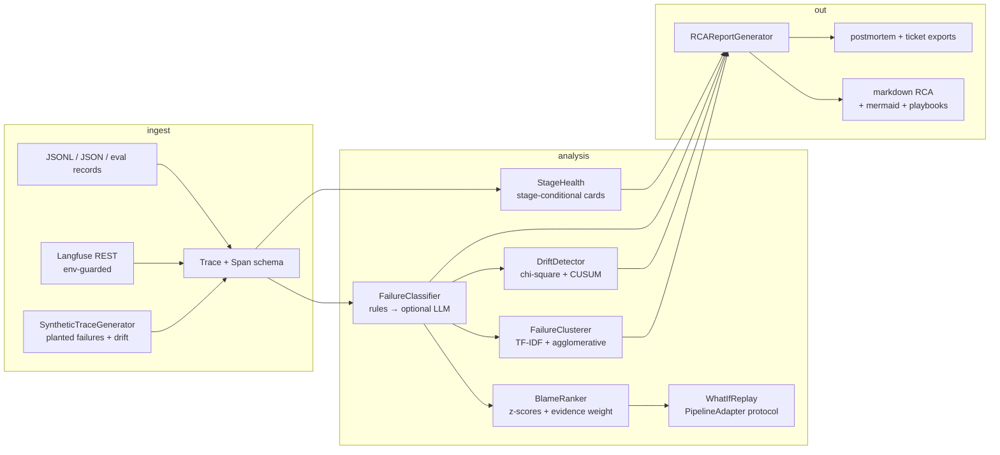

# ForensiQ — Failure Forensics for AI Pipelines

[](brag-output/brag.mp4)


[](LICENSE)
[](pyproject.toml)
[](ruff.toml)


## 🟢 New to AI? Read this first

**The problem, in human terms.** An AI search assistant starts giving bad answers. Nobody knows why. The engineer guesses: bad documents? broken search? a model update? Without a recording of what happened inside each request, debugging is Ouija-board work — and Tuesday's fix might break Wednesday.

**What this project does.** ForensiQ is the **flight recorder + detective** for AI pipelines:

- **It records.** Every request leaves a trace — what was searched, what was found, what was sent to the model, what came back. ForensiQ ingests those traces (from Langfuse, the industry's standard flight-recorder, or plain JSON files) and normalises them.
- **It names the failure.** A rulebook of known failure types — "search returned nothing" (F-RET-001), "prompt got silently truncated" (F-PROMPT-002), "model got stuck repeating itself" (F-GEN-003), and so on — is checked first; only genuinely ambiguous cases go to an AI classifier. On a seeded 560-trace corpus with planted failures, this two-pass approach scores **precision and recall of 1.0** against the known ground truth.
- **It points at the guilty stage.** For each failure it ranks *which stage* of the assembly line is to blame, with the evidence quoted from the trace. On planted-failure fixtures it puts the true root cause first **100% of the time**.
- **It spots the slow leak.** Some rot isn't a crash — search quality quietly degrades over weeks. A statistical drift detector (a hand-rolled chi-square test) compares this week's failure mix against a baseline window and raises an alarm when the shift is too big to be luck (and stays quiet when it is luck — no false alarms at the 1% significance level).
- **It writes the incident report.** A generated RCA (root-cause-analysis) document with a timeline, a blame diagram, the evidence, and a mapped fix from a playbook — the artifact a manager actually reads the morning after.

**Measured outcomes:** 128 automated tests pass offline in ~4s — including the planted-ground-truth scoring above, clustering that recovers all 8 planted failure families perfectly, and a counterfactual replay module ("would raising the result count have fixed this?") that is honest about being an estimate. It speaks the exact vocabulary of the author's RAG_showcase pipeline, so traces flow in with zero glue code.

**Most RAG observability stops at "the answer was bad".** ForensiQ answers the
senior questions: *which* failure is it (by taxonomy id), *which stage* caused
it (with evidence, not vibes), *is it getting worse* (drift, tested not
eyeballed), and *would the fix have worked* (counterfactual replay). It is the
forensics layer for pipelines like my own
[RAG_showcase](https://github.com/AkshayJohn03/RAG_showcase): when faithfulness
drops from 0.91 to 0.72, ForensiQ tells you whether that is an index freshness
problem, a prompt truncation problem, or a decoder loop — before you start
re-embedding things at random.

```
traces (JSONL / JSON / Langfuse REST)          the pipeline being autopsied
        │  ingest/     normalized Trace+Span model (embed/retrieve/rerank/
        │              graph/generate + guard/tool/agent)
        ▼
taxonomy/    two-pass classifier: deterministic rules first (F-RET-*, F-PROMPT-*,
        │    F-GEN-*, F-TOOL-*, F-INFRA-*), optional LLM pass for leftovers
        ▼
attribution/ stage health cards → blame ranking (z-scores vs healthy baseline
        │    + taxonomy evidence) → what-if counterfactual replay
        ▼
patterns/    TF-IDF + agglomerative failure families · chi-square + CUSUM drift
        ▼
report/      deterministic markdown RCA: executive summary, blame graph,
             mermaid timeline, cluster cards, mapped fix playbooks,
             postmortem + ticket exports
```

## Why senior-level (and what the trade-offs are)

| Decision | What juniors do | What ForensiQ does instead |
|---|---|---|
| Classification | One LLM call per trace ("looks like retrieval?") | **Rules-first**: 9 deterministic, evidence-quoting rules handle ~everything; the LLM only sees ambiguous leftovers and can be down entirely — an `EchoMockClient` fallback keeps classification working during the outage that caused the failures |
| "Which stage broke?" | Guess from the failure label | **Blame ranking**: per-stage directional z-scores of attrs vs the *healthy* baseline, plus the taxonomy evidence weight — the failure label and the numeric anomaly have to agree |
| Health scoring | One overall "quality" number | **Stage-conditional cards** — retrieval sickness and generation sickness have different owners and playbooks; retrieval gets hit-rate/k-coverage/mean-score, generation gets a groundedness heuristic that double-penalizes fabricated numbers and entities (improving on RAG_showcase's lexical faithfulness) |
| Drift | "failures went up, ship it" | **Chi-square GOF** of the failure mix vs the baseline window (small-count pooling, alpha=0.01, a 2-of-3 trailing-window rule so one noisy window can't reset a sustained signal — and a blip can't fire it) + CUSUM per class for slow ramps — calibrated false-alarm rate instead of a guessed threshold |
| "Would top_k=10 fix it?" | Assume yes | **Counterfactual replay** with an honest effect model: raising top_k *dilutes* the mean hit score and cannot fix an empty index — the simulation says so instead of selling a fix |
| Stats deps | `import sklearn, scipy` | TF-IDF, average-linkage clustering, k-means, chi-square survival function (incomplete gamma, Numerical Recipes) — all hand-rolled, because forensics tooling should not need a 200MB stack to count words |

Full trade-off discussion in [Design decisions](#design-decisions).

## Quickstart (fully offline, no keys)

```bash
pip install -e .
forensiq demo                      # synthetic 28-day corpus with planted failures
                                   # → ./forensiq-output/rca.md + artifacts
```

You get a report over 560 traces with ~40% planted failures and a day-15
retrieval drift: executive summary, failure mix, blame-ranked root causes with
quoted span evidence, mermaid blame graph + timeline, cluster cards, drift
alerts, mapped playbook fixes.

```bash
# Analyze your own pipeline's export:
forensiq ingest  --file traces.jsonl
forensiq analyze --file traces.jsonl
forensiq report  --file traces.jsonl --out rca.md
forensiq watch   --file traces.jsonl --baseline-days 14   # JSON drift alerts
forensiq replay  --file traces.jsonl --taxonomy F-PROMPT-001
```

```python
from forensiq.ingest.loaders import JSONLTraceLoader
from forensiq.taxonomy.classifier import FailureClassifier
from forensiq.attribution.blame import BlameRanker
from forensiq.report.rca import RCAReportGenerator, ReportInputs
from forensiq.attribution.health import StageHealth

traces = JSONLTraceLoader().load("traces.jsonl")
failures = FailureClassifier().classify_cohort(traces)
ranker = BlameRanker.from_traces(traces, failures)
blame = ranker.cohort_blame(traces, failures)     # e.g. F-RET-002 → {"retrieve": 1.0}
report = RCAReportGenerator.with_yaml("docs/playbooks.yaml").generate(
    traces,
    ReportInputs(failures=failures, health=StageHealth().score(traces), blame_distribution=blame),
)
```

## RAG_showcase integration

ForensiQ is designed to autopsy [RAG_showcase](https://github.com/AkshayJohn03/RAG_showcase)
out of the box. The alignment is deliberate, not cosmetic:

- **Span stages.** RAG_showcase emits Langfuse per-stage spans
  `embed → hybrid → rerank → graph → generate`. ForensiQ's canonical vocabulary
  is `embed / retrieve / rerank / graph / generate / guard / tool / agent`, and
  `ingest/schema.py::STAGE_ALIASES` maps `hybrid`, `retrieval`, `search` →
  `retrieve` (plus `generation`/`llm` → `generate`, `guardrail` → `guard`), so
  its exports ingest unchanged.
- **Metric names.** `attribution/health.py` continues RAG_showcase's
  `backend/app/eval/metrics.py` vocabulary — `faithfulness`, context
  precision/recall, `answer_relevance` — so a report row and an eval row can be
  read side by side. ForensiQ's `groundedness()` is the same lexical claim
  grounding heuristic, improved: numbers and capitalized entities are
  **anchored tokens** that count double when fabricated (RAG_showcase's
  documented weakness on paraphrased numbers), and the negation guard penalizes
  answers that deny what the context affirms.
- **Refusal phrasings.** The F-GEN-003 refusal list mirrors RAG_showcase's
  abstention regex family, so its correct-abstention behavior is not
  misclassified as a generation failure.
- **Content.** The synthetic demo corpus reuses RAG_showcase's fictional
  enterprise entities (Nordwerk Precision GmbH, XK-7, Helios 4.2, SAF-114), so
  demo evidence chains read like the real pipeline's incidents.

### Concrete flow: export traces → forensiq ingest → report

1. **Export traces from RAG_showcase.** Every answer already carries per-stage
   spans when `LANGFUSE_PUBLIC_KEY`/`LANGFUSE_SECRET_KEY` are set. Either:

   ```bash
   forensiq ingest --langfuse          # REST pull via httpx (env-guarded)
   ```

   or dump spans to JSONL yourself (Langfuse UI export / API) — one trace per
   line:

   ```json
   {"trace_id": "q-1042", "ts": "2026-08-14T09:12:00Z", "pipeline_name": "rag_showcase",
    "spans": [
      {"span_id": "s1", "name": "embed", "stage": "embed", "duration_ms": 12, "status": "ok",
       "attrs": {"model": "MiniLM-L6"}},
      {"span_id": "s2", "parent_id": "s1", "name": "hybrid", "stage": "hybrid", "duration_ms": 44,
       "status": "ok", "attrs": {"top_k": 5, "hit_count": 5, "hit_scores": [0.81, 0.77, 0.61, 0.44, 0.39]}},
      {"span_id": "s3", "parent_id": "s2", "name": "rerank", "stage": "rerank", "duration_ms": 30,
       "status": "ok", "attrs": {"rerank_delta": 0.18, "rerank_top1": 0.95}},
      {"span_id": "s4", "parent_id": "s2", "name": "generate", "stage": "generate", "duration_ms": 1800,
       "status": "ok", "tokens_in": 1204, "tokens_out": 210, "cost": 0.002,
       "attrs": {"model": "qwen3:1.7b", "prompt_chars": 4800, "finish_reason": "stop",
                 "output": "...", "context": "..."}}
    ]}
   ```

   Stage names can be the raw RAG_showcase ones (`hybrid`) — they normalize on
   ingest. Eval-style records (`{"query", "retrieved": [...], "answer",
   "metrics": {...}}`) are accepted too and become retrieve+generate traces.

2. **Ingest + analyze + report:**

   ```bash
   forensiq report --file rag_showcase_traces.jsonl --out rca.md
   ```

3. **Watch it** in CI or a cron: `forensiq watch --file traces.jsonl
   --baseline-days 14` exits with JSON drift alerts you can pipe to Slack.

The same JSONL contract is already emitted by my other agent portfolios
(AegisGate / SwarmResearch span hooks) via `spans_from_dicts`, so one forensics
tool covers all of them.

## Architecture



## Module map

```
src/forensiq/
  ingest/
    schema.py       Trace/Span model, stage vocabulary + RAG_showcase aliases
    loaders.py      JSONLTraceLoader · JSONTraceLoader · LangfuseTraceLoader ·
                    spans_from_dicts (AegisGate/SwarmResearch hook adapter)
    synthetic.py    seeded 28-day corpus, 8 planted failure modes, day-15 drift
  taxonomy/
    classifier.py   two-pass classifier; evidence chains; precedence rules
  attribution/
    health.py       stage cards, groundedness (anchored tokens + negation guard)
    blame.py        per-stage directional z-scores vs healthy baseline → ranking
    replay.py       PipelineAdapter protocol · SimulatedAdapter effect model
  patterns/
    cluster.py      hand-rolled TF-IDF, average linkage, k-means fallback
    drift.py        chi-square GOF (pooled small counts) + CUSUM, JSON alerts
  report/
    rca.py          deterministic markdown RCA, mermaid, playbooks, exports
  llm.py            LLMClient Protocol · OpenAICompatClient · EchoMockClient
  config.py         pydantic-settings (FORENSIQ_* env prefix)
  cli.py            demo / ingest / analyze / report / watch / replay
```

## Failure taxonomy

Full table with signatures and precedence: [docs/TAXONOMY.md](docs/TAXONOMY.md).
Fix playbooks (per-id first response): [docs/PLAYBOOKS.md](docs/PLAYBOOKS.md),
overridable via [docs/playbooks.yaml](docs/playbooks.yaml).

| family | ids |
|---|---|
| F-RET-* | 001 empty retrieval set · 002 low-recall context · 003 score collapse (drift) |
| F-PROMPT-* | 001 prompt truncation |
| F-GEN-* | 001 structured-output format break · 002 repetition loop · 003 ungrounded refusal · 004 ungrounded claim (health-flagged) |
| F-TOOL-* | 001 tool execution error |
| F-INFRA-* | 001 stage timeout · 002 cost spike · 003 guard abort |

## Design decisions (with trade-offs)

**Rules-first vs LLM classification.** A per-trace LLM call is the easy
design and the wrong one: it is slow at cohort scale, nondeterministic
(reports stop being diffable), and — the fatal part — unavailable exactly when
you need forensics most (provider outage, quota exhaustion). ForensiQ's pass 1
is 9 deterministic rules that quote span evidence and are unit-testable in
milliseconds; pass 2 sends only ambiguous leftovers (error spans, guard
blocks) to an LLM behind the `LLMClient` Protocol. Trade-off: rules have
blinders — a novel failure mode with no signature gets nothing until someone
writes the rule. That is what pass 2 and the taxonomy's `F-INFRA-003`
catch-all are for, and the cost of a missed novel mode is a gap in coverage,
not a wrong answer presented with LLM confidence.

**Stage-conditional health scores.** One "trace quality" number optimizes for
dashboards and against diagnosis. Retrieval degradation and generation
degradation have different owners, different fixes and different SLOs.
ForensiQ emits per-stage cards with stage-specific metrics (hit rate,
k-coverage, mean score for retrieval; groundedness for generation; rerank
delta for rerank). Trade-off: more surface to keep thresholds honest for —
mitigated by statuses derived from thresholds that are config, not folklore.

**Blame ranking: z-scores + evidence weight, not just the label.** The
classifier says *what* failed; the blame ranker checks *where the numbers are
abnormal* against the healthy-trace baseline (failed traces excluded from the
baseline so the yardstick is clean). The two must agree; when they do, the
evidence chain is quotable in a postmortem. Trade-off: z-scores assume
roughly unimodal stage behavior — a bimodal stage (two very different query
shapes) will need segment-level baselines; noted as a limitation, not
hand-waved.

**Why chi-square over KL for mix drift.** The failure mix is sparse count
data (≤8 classes, tens of failures per window). Chi-square GOF gives a
calibrated p-value against the baseline mix with a small-count pooling guard,
so the alert rate is a chosen alpha, not a guessed KL threshold; KL on sparse
counts has no null distribution without resampling (bootstrap adds moving
parts for no accuracy gain at this n). Engineering guardrails on top: small
windows pool into "other", and an alert needs 2 of the last 3 trailing
windows significant — overlapping windows share days, so one noisy window
must not reset a sustained signal, while under the null a 2-of-3 run has
probability ~3e-4 per position. CUSUM per class catches slow ramps the
windowed test is sluggish on. Trade-off: chi-square tests *any* deviation, so
a deliberate change (you shipped a prompt change that raises refusals on
purpose) fires too — drift detection measures change, not badness; the report
separates the two for a human.

**Counterfactual replay limits.** The `PipelineAdapter` protocol is the honest
part: ForensiQ does not pretend to know what your retrieval layer would return
for top_k=10. The shipped `SimulatedAdapter` is an *estimate* with a
documented effect model — and it is deliberately pessimistic where honesty
matters: raising top_k adds marginal hits *below* the current mean (dilution),
and an empty index stays empty. Trade-off: simulated resolution is a
hypothesis, not a measurement; wire a real adapter and ForensiQ records
predicted-vs-actual for calibration.

**Determinism.** Reports contain no wall-clock data — the window comes from
trace timestamps, every table is sorted, representative evidence picks the
first failure in trace order. Two runs over the same corpus produce
byte-identical reports, which makes report diffing a legitimate review tool.

## Configuration reference

All optional, `FORENSIQ_` env prefix (see [.env.example](.env.example)):

| variable | default | meaning |
|---|---|---|
| `FORENSIQ_LOW_SCORE_THRESHOLD` | 0.5 | retrieve mean hit score below this ⇒ F-RET-002 |
| `FORENSIQ_COST_SPIKE_FACTOR` | 3.0 | cost spike = cohort p95 × factor |
| `FORENSIQ_CONTEXT_LIMIT` | 8192 | context ceiling for F-PROMPT-001 |
| `FORENSIQ_REPETITION_MIN_REPEAT` | 5 | n-gram repeats before F-GEN-002 |
| `FORENSIQ_ALPHA` | 0.01 | drift test significance level |
| `FORENSIQ_BASELINE_DAYS` / `FORENSIQ_WINDOW_DAYS` | 14 / 3 | drift baseline and trailing window |
| `FORENSIQ_LLM_ENABLED` | false | enable the pass-2 LLM (needs key) |
| `FORENSIQ_LLM_BASE_URL` / `FORENSIQ_LLM_API_KEY` / `FORENSIQ_LLM_MODEL` | — | any OpenAI-compatible endpoint |
| `LANGFUSE_HOST` / `LANGFUSE_PUBLIC_KEY` / `LANGFUSE_SECRET_KEY` | — | required for `ingest --langfuse` |

## Testing

```bash
python -m pytest -q            # fully offline, seeded
python -m ruff check src tests
```

The suite scores the classifiers *against the planted ground truth* rather
than asserting vibes: precision/recall ≥ 0.9 of rule classification on the
synthetic corpus, blame top-1 stage correct in ≥ 80% of targeted fixtures,
chi-square drift firing on the planted day-15 degradation while the stable
window stays quiet at α=0.01, TF-IDF clustering recovering planted failure
families (intra-cluster distance < inter-cluster), loaders round-tripping
portfolio span dicts. No test touches network; `OpenAICompatClient` and the
Langfuse REST path are env-guarded and exercised only through recorded
fixtures / the offline mock.

## Production notes

- **Sample before you ingest.** At 100% trace capture a busy pipeline drowns
  the signal; sample 1-10% of *healthy* traces and 100% of errored/negative
  feedback traces. ForensiQ's statistics (mix drift, blame) only need
  hundreds of failures, not millions of traces.
- **PII in traces.** Span attrs routinely carry user text. ForensiQ reads
  attrs but never logs them at INFO; run ingestion inside your trust boundary,
  redact upstream (RAG_showcase's PII guard helps), and treat `failures.json`
  exports as sensitive — the ticket export quotes evidence verbatim.
- **Retention.** Keep failure records + daily mix vectors long (drift baselines
  need weeks), drop raw span payloads on a short TTL. The drift detector only
  needs `(day, taxonomy_id)` events; store full traces for the recent window
  you are actively autopsying.
- **Cost attribution.** The cost-spike rule is cohort-relative (p95 × factor)
  by design — absolute cost thresholds rot the moment you change models.

## Limitations

- Groundedness is a lexical heuristic, not an NLI judge — paraphrase-heavy
  answers under-score (the same documented limitation as RAG_showcase's
  faithfulness; the fix path is the same: an LLM judge, which ForensiQ's
  protocol already accommodates).
- One primary failure per trace (precedence-ordered); correlated multi-failure
  traces surface only their highest-precedence cause.
- Z-score baselines assume unimodal stage behavior; heterogeneous traffic
  needs segment-level baselines.
- The simulated replay effect model is an estimate; real calibration requires
  a real `PipelineAdapter`.
- Drift detection measures *change*, not *badness* — intentional mix changes
  fire alerts for a human to bless.

## Roadmap

- [ ] Segment-aware baselines (per query-shape / per tenant blame)
- [ ] Predicted-vs-actual calibration report for replay adapters
- [ ] Streaming ingestion (consume trace tails instead of files)
- [ ] LLM-judge groundedness behind the existing `LLMClient` Protocol
- [ ] Per-failure-type SLO burn alerts wired to the drift payloads

## License

MIT — © 2026 Akshay John Xavier.
